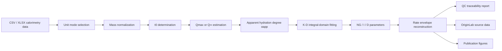

<p align="center">
  <h1 align="center">🌌 Hydration Kinetics Pro</h1>
  <p align="center">
    <strong>A research-oriented computational tool for isothermal calorimetry, apparent hydration kinetics, and publication-grade kinetic visualization</strong>
    <br><br>
    <a href="https://www.python.org/"></a>
    <a href="https://scipy.org/"></a>
    <a href="https://pandas.pydata.org/"></a>
    <a href="https://www.qt.io/"></a>
    <a href="LICENSE"></a>
  </p>
</p>

---

## 1. Research Positioning

Hydration Kinetics Pro 是我围绕水泥基材料等温量热数据搭建的一套表观水化动力学分析工具。这个项目最初并不是为了“把曲线画得好看”，而是因为我在处理等温量热数据时发现：如果只看热流峰值、峰位或者 24 h、72 h 累计热量，很多信息其实被压缩掉了。

水化曲线背后真正值得分析的，是热量释放过程中的起始、加速、降速和扩散受限等动力学特征。因此，我希望这个工具能够完成一件事：

> 将等温量热曲线从“实验信号”转化为“可追溯、可复查、可用于论文论证的表观动力学证据链”。

在这个过程中，我特别关注三个基础问题：

1. 热流和累计热量到底是总量，还是已经按质量归一化？
2. K-D 动力学分析的起算时间 \(t_0\) 应该如何确定？
3. 表观水化度 \(\alpha\) 的分母 \(Q_{max}\) 来自哪里，它的可信度如何记录？

我的理解是，水化动力学分析最怕的不是公式复杂，而是公式套得太快。所以这个项目没有把 K-D 模型包装成一个“全自动真值计算器”，而是尽量把单位、\(t_0\)、\(Q_{max}\)、\(R^2\)、fallback 和 warning 都显式写出来，让每一步计算都能被追问、被复查、被重新绘图。

本项目主要用于水泥、砂浆、ECC / SHCC 等水泥基材料的等温量热数据分析，尤其适合比较不同胶凝材料组成下的早期水化行为差异。

典型应用包括：

- 等温量热数据清洗与单位归一化；
- 诱导期、加速期、减速期等宏观阶段识别；
- 基于 Knudsen 外推估计极限放热量 \(Q_{max}\)；
- 基于 Krstulovic-Dabic 模型提取表观动力学参数；
- 构建 NG、I、D 三阶段积分域验证图；
- 重构 \(F_{NG}\)、\(F_I\)、\(F_D\) 机制速率包络线；
- 导出 Excel QC 报表、OriginLab 源数据和 publication-grade 图谱。

这里得到的参数应被理解为：

```text
apparent hydration kinetic descriptors
```

也就是基于宏观热量信号反演得到的表观动力学描述。它可以用于比较不同体系的水化速率、阶段演化和机制倾向，但不应被直接等同为某一个单独矿物相或某一种水化产物的真实生成速率。

---

## 2. Computational Philosophy

我在写这个工具时，基本遵循一个思路：

```text
先把物理量定义清楚，再谈拟合；
先把拟合来源记录清楚，再谈机制解释；
先承认模型边界，再输出论文图谱。
```

整个计算链路如下：

```text
Raw calorimetry data
        ↓
Unit mode selection
        ↓
Mass normalization
        ↓
t0 determination
        ↓
Q∞ / Qmax estimation
        ↓
Apparent hydration degree αapp
        ↓
K-D integral-domain fitting
        ↓
Rate-envelope reconstruction
        ↓
Excel QC report + OriginLab source data + publication figures
```

对应逻辑可以写成：



---

## 3. Input Data and Unit System

等温量热数据最容易出错的地方之一，是单位基准不清楚。同样一列 heat flow，可能表示总热流 \(mW\)，也可能表示归一化后的 \(mW/g\)。如果这里选错，后面的 \(Q_{max}\)、\(\alpha\)、\(K_1\)、\(K_2\)、\(K_3\) 都会系统性偏移。

因此本项目显式区分两种输入模式。

| Mode | Meaning | Program behavior |
|---|---|---|
| `total` | 总热流 \(mW\)、总累计热量 \(J\) | 按有效质量归一化为 \(mW/g\)、\(J/g\) |
| `normalized` | 已归一化热流 \(mW/g\)、累计热量 \(J/g\) | 不再除以质量，直接进入后续计算 |

这里的有效质量建议使用：

```text
cementitious binder mass
```

而不是包含水、砂、纤维在内的总试样质量。因为水化热通常需要按胶凝材料质量归一化，尤其在 ECC 或 SHCC 体系中，砂和纤维质量如果被纳入分母，会明显稀释热量指标。

推荐 normalized 数据格式：

```csv
time_h,heat_flow_mw_g,cumulative_heat_j_g
0.0,0.000,0.000
0.5,0.152,0.270
1.0,0.284,0.850
```

推荐 total 数据格式：

```csv
time_h,heat_flow_mw,cumulative_heat_j
0.0,0.000,0.000
0.5,0.760,1.350
1.0,1.420,4.250
```

当前支持：

```text
.csv
.xlsx
```

旧式 `.xls` 暂不支持，建议先另存为 `.xlsx`。

软件会尝试根据表头识别单位模式。若表头和 GUI 选择不一致，程序只弹出提醒，不强制中断。最终计算以 GUI 中用户选择的单位模式为准，并将提醒写入 `QC_Parser_Warnings`，方便后期复查。

---

## 4. Definition of \(t_0\)

在 K-D 模型中，\(t_0\) 不是简单的实验开始时间。我把它理解为主水化动力学过程的表观起算点：

\[
t_0 = \text{the apparent starting time of the main hydration kinetic process}
\]

等温量热曲线早期常常包含初始溶解峰、装样扰动和仪器温度平衡过程。如果直接从 0 h 开始计算，可能会把不属于主加速水化过程的热信号引入模型。

因此，软件提供两种 \(t_0\) 策略。

| Mode | Description | Suggested use |
|---|---|---|
| Auto \(t_0\) | 自动寻找诱导期低谷 | 普通 OPC 或主峰清晰数据 |
| Manual \(t_0\) | 用户根据曲线手动指定 | 掺合料、外加剂、海水、PAM 等复杂体系 |

我自己的判断规则是：

```text
t0 应位于初始溶解峰之后；
t0 应位于主加速峰之前；
t0 之后累计热量应持续增长；
同一批样品应使用一致的判定规则。
```

这也是我保留手动 \(t_0\) 的原因。不是为了调参，而是因为复杂胶凝体系中，算法自动识别的低谷不一定等于研究者真正想定义的动力学起点。

---

## 5. From Heat Release to Apparent Hydration Degree

等温量热直接测到的是热流和累计热量，而 K-D 模型需要的是水化程度 \(\alpha\)。因此，需要先建立热量信号与表观水化度之间的关系。

我在软件中采用的定义为：

\[
\alpha_{app}(t)=\frac{Q(t)-Q(t_0)}{Q_{max,eff}}
\]

其中：

\[
Q_{max,eff}=Q_{\infty}-Q(t_0)
\]

这里我刻意区分两个概念。

| Symbol | Meaning |
|---|---|
| \(Q_{\infty}\) | 从实验起点计的总极限累计放热量 |
| \(Q_{max,eff}\) | 从 \(t_0\) 之后计的有效极限放热量 |

如果用户手动输入 \(Q_{\infty}\)，软件不会直接把它当作 K-D 分母，而是自动扣除 \(Q(t_0)\)：

\[
Q_{max,eff}=Q_{\infty}-Q(t_0)
\]

这样做更符合实验习惯。因为从长龄期量热、理论水化热或文献中得到的通常是总累计极限热量 \(Q_{\infty}\)，而不是从 \(t_0\) 开始重新定义后的有效热量。

---

## 6. \(Q_{max}\) Estimation Strategy

\(Q_{max}\) 是整个计算中最敏感的锚点之一。因为它进入 \(\alpha\) 的分母，进而影响 \(K_1\)、\(K_2\)、\(K_3\)、\(\alpha_1\)、\(\alpha_2\) 等所有后续参数。

软件采用如下优先级：

```text
Manual Q∞ > Knudsen linear extrapolation > Qfinal × 1.15 fallback
```

### 6.1 Manual \(Q_{\infty}\)

如果有长龄期累计热量、理论极限放热量或可靠文献值，建议手动指定 \(Q_{\infty}\)。这在论文分析中通常比盲目依赖短龄期外推更稳。

### 6.2 Knudsen Asymptotic Extrapolation

当未手动指定 \(Q_{\infty}\) 时，软件尝试采用 Knudsen 外推：

\[
\frac{1}{Q}
=
\frac{1}{Q_{max}}
+
\frac{t_{50}}{Q_{max}}\cdot\frac{1}{t-t_0}
\]

若后期数据在 \(1/Q\) 与 \(1/(t-t_0)\) 坐标下具有线性关系，则：

\[
Q_{max}=\frac{1}{intercept}
\]

并且：

\[
t_{50}=slope \cdot Q_{max}
\]

这个图的意义不只是拟合一条直线，而是检查后期降速阶段是否能够支持一个稳定的极限放热量估计。

### 6.3 Fallback \(Q_{final}\times1.15\)

如果 Knudsen 外推失败，软件可以使用：

\[
Q_{max}=1.15Q_{final}
\]

作为保守 fallback。

但我把 fallback 设计成低置信度策略。它可以用于快速筛查和 smoke test，但不建议作为论文核心参数的高置信度来源。只要触发 fallback，软件都会在 Excel 中记录 warning。

---

## 7. K-D Model: Integral-Domain Formulation

本项目采用 Krstulovic-Dabic 模型，将水化过程描述为三个表观动力学阶段：

1. NG: nucleation and crystal growth；
2. I: phase boundary interaction；
3. D: diffusion control。

这里的三阶段不是把真实水化过程切成三个互不重叠的物理阶段，而是把宏观放热曲线投影到三个可解释的动力学函数上。我更倾向于把它理解为：

```text
a kinetic decomposition of the calorimetric signal
```

而不是对微观反应路径的绝对分割。

---

### 7.1 NG Stage: Nucleation and Growth

NG 阶段采用 Avrami 型积分形式：

\[
[-\ln(1-\alpha)]^{1/n}=K_1'(t-t_0)
\]

两边取对数：

\[
\ln[-\ln(1-\alpha)]
=
n\ln(t-t_0)+n\ln K_1'
\]

令：

\[
Y_{NG}=\ln[-\ln(1-\alpha)]
\]

\[
X=\ln(t-t_0)
\]

则：

\[
Y_{NG}=nX+n\ln K_1'
\]

因此，线性拟合斜率为 \(n\)，截距为 \(n\ln K_1'\)。进一步可得：

\[
K_1'=\exp\left(\frac{intercept}{n}\right)
\]

对应的速率函数为：

\[
F_{NG}(\alpha)
=
K_1 n(1-\alpha)[-\ln(1-\alpha)]^{\frac{n-1}{n}}
\]

这里的 \(n\) 不应被机械解释为严格几何维度，而更适合作为宏观热流信号中的表观成核-生长指数。

---

### 7.2 I Stage: Phase Boundary Reaction

I 阶段采用相边界反应形式：

\[
1-(1-\alpha)^{1/3}=K_2'(t-t_0)
\]

取对数：

\[
\ln[1-(1-\alpha)^{1/3}]
=
\ln(t-t_0)+\ln K_2'
\]

令：

\[
Y_I=\ln[1-(1-\alpha)^{1/3}]
\]

\[
X=\ln(t-t_0)
\]

则：

\[
Y_I=X+\ln K_2'
\]

所以：

\[
K_2'=\exp(intercept)
\]

在代码中，我采用斜率固定为 1 的方式估计 \(K_2\)。这样做是为了避免 I 阶段数据窗口较窄时出现过度自由拟合。相比让斜率任意漂移，固定理论斜率更能保留 K-D 模型本身的物理约束。

对应速率函数为：

\[
F_I(\alpha)
=
3K_2(1-\alpha)^{2/3}
\]

---

### 7.3 D Stage: Diffusion Control

D 阶段采用扩散控制形式：

\[
[1-(1-\alpha)^{1/3}]^2=K_3'(t-t_0)
\]

取对数：

\[
2\ln[1-(1-\alpha)^{1/3}]
=
\ln(t-t_0)+\ln K_3'
\]

令：

\[
Y_D=2\ln[1-(1-\alpha)^{1/3}]
\]

\[
X=\ln(t-t_0)
\]

则：

\[
Y_D=X+\ln K_3'
\]

因此：

\[
K_3'=\exp(intercept)
\]

对应速率函数为：

\[
F_D(\alpha)
=
\frac{3K_3(1-\alpha)^{2/3}}
{2[1-(1-\alpha)^{1/3}]}
\]

D 阶段的意义在于描述后期水化中由于产物层增厚、孔结构细化和传质路径延长导致的扩散受限行为。但在实际水泥基材料中，扩散控制并不是突然出现的，而是逐步增强的。因此软件输出的 \(\alpha_2\) 更适合作为表观转换指标，而不是绝对微观分界点。

---

## 8. Mechanism Transition Indices

在得到 \(F_{NG}\)、\(F_I\)、\(F_D\) 之后，软件会重构动力学率包络线，并估计两个机制转换指标：

| Index | Interpretation |
|---|---|
| \(\alpha_1\) | NG 阶段向后续控制阶段转变的表观边界 |
| \(\alpha_2\) | D 阶段开始占主导的表观边界 |

我更倾向于把 \(\alpha_1\)、\(\alpha_2\) 称为：

```text
K-D model transition indices
```

而不是直接称为真实反应阶段分界点。因为真实水泥水化中，成核、生长、界面反应、离子扩散和空间填充往往是交叠发生的。模型给出的边界是热量信号中的表观控制关系，而不是显微结构中的硬切线。

---

## 9. Experimental Rate and Model Rate Envelope

热流可以进一步转化为表观反应速率：

\[
\frac{d\alpha}{dt}
=
\frac{1}{Q_{max,eff}}\frac{dQ}{dt}
\]

由于热流单位为 \(mW/g\)，而：

\[
1\ mW = 10^{-3}\ J/s
\]

所以换算到 \(J/(g\cdot h)\) 时：

\[
heat\ flow\ (mW/g)\times 3.6
\]

因此软件中实验表观速率为：

\[
\left(\frac{d\alpha}{dt}\right)_{exp}
=
\frac{heat\ flow\ (mW/g)\times 3.6}{Q_{max,eff}}
\]

这一步很关键。它把原始热流曲线和 K-D 理论速率函数放到了同一个 \(\alpha-d\alpha/dt\) 坐标系中，使得 \(F_{NG}\)、\(F_I\)、\(F_D\) 的控制关系可以被直接可视化。

---

## 10. Publication-Oriented OriginLab Workflow

为了让结果更接近 SCI 论文中的图谱组织方式，本项目不仅导出 PNG 图片，还会导出 OriginLab 可复现的数据工作表。我的想法是，论文图谱不应该只是软件截图，而应该是可重新绘制、可重新拟合、可被审稿人追溯的数据证据。

| 出版图谱目标 | 映射工作表 Sheet | OriginLab 渲染逻辑 | 学术论证意义 |
|---|---|---|---|
| Knudsen 渐近外推 | `1_Knudsen拟合` | 选中 `X_All / Y_All` 作原始散点；选中 `X_Fit / Y_Fit` 进行 Linear Fit | 截距倒数映射体系极限水化热潜力 \(Q_{max}\)，并对宏观降速期进行全局检查 |
| K-D 机制积分域验证 | `2_KD分段散点拟合` | 分别选中 NG、I、D 的积分域散点列进行 Linear Fit | 直接呈现各机制区间的线性一致性和 \(R^2\)，避免只给参数不展示拟合依据 |
| 动力学率包络演化 | `3_理论速率包络线` | 以 \(\alpha\) 为横轴，以实验速率和理论速率函数矩阵为纵轴作线图 | 展示 \(F_{NG}\)、\(F_I\)、\(F_D\) 在 \(\alpha_1\)、\(\alpha_2\) 附近的控制接力和机制跃迁趋势 |

这三类图谱对应了完整的逻辑链：

```text
Qmax 是否可靠
    ↓
K-D 参数是否来自真实线性区
    ↓
机制解释是否能被速率包络支持
```

也就是说，图谱不是为了装饰，而是为了让计算逻辑显性化。

---

## 11. Excel QC Traceability

软件导出的 Excel 报表包含多个 QC sheet。我这样设计的原因是：动力学参数本身并不足够，参数的来源、风险和 warning 同样重要。

| Sheet | Content | Why it matters |
|---|---|---|
| `QC_Traceability` | 单位模式、\(t_0\) 来源、\(Q(t_0)\)、\(Q_{\infty}\)、Qmax 来源、fallback 状态 | 追溯关键计算锚点 |
| `QC_R2_Review` | Knudsen、NG、I、D 的 \(R^2\) 与质量判读 | 判断拟合结果是否适合进入论文讨论 |
| `QC_Warnings` | solver 中记录的 warning | 防止 fallback 或异常数据被隐藏 |
| `QC_Parser_Warnings` | 表头单位和 GUI 选择不一致等提醒 | 记录数据预处理风险 |
| `Tab5_Knudsen` | Qmax、t50、Knudsen 方程和 Qmax 来源 | 对应极限放热量估计 |
| `Tab6_KD_Eqs` | NG、I、D 三阶段拟合方程与 \(R^2\) | 对应积分域验证 |
| `Tab7_KD_Params` | \(n\)、\(K_1\)、\(K_2\)、\(K_3\)、\(\alpha_1\)、\(\alpha_2\) | 对应论文主参数表 |
| `水化阶段特征` | 休眠期、加速期、减速期 | 对应宏观阶段划分 |
| `放热峰特征提取` | 自动识别放热峰 | 对应热流曲线特征 |
| `特定龄期热量` | 指定龄期累计热量 | 对应常用龄期比较指标 |

---

## 12. GUI Design: Data First, Plots on Demand

当前 GUI 的设计思路是：

```text
data first, plots on demand
```

也就是数据表是主视图，图像用于辅助检查和论文图谱预览。

左侧为操作控制区：

```text
① 数据与单位
② 论文级锚点控制
③ 工程辅助提取
④ 科研成果输出
```

右侧上方为结果数据区，直接显示完整参数表：

- K-D 动力学核心参数；
- 水化机制阶段时间特征；
- 放热速率特征峰；
- 特定龄期累计热量。

右侧下方为图表区。图表默认采用双列 dashboard，一排两个图，避免单张图在低高度区域被拉伸变形。

图表包括：

```text
1. Calorimetry Raw Data
2. Knudsen Extrapolation
3. Integral-Domain Regressions
4. Kinetics Mechanism Envelope
```

---

## 13. Exported Figures

软件支持一键导出高分辨率科研图像：

```text
Kinetics_Dashboard_HighRes.png
Fig1_Calorimetry_Raw_Data.png
Fig2_Knudsen_Extrapolation.png
Fig3_KD_Integral_Domain_Regressions.png
Fig4_Kinetics_Mechanism_Envelope.png
```

其中 dashboard 适合整体展示，四张独立图更适合论文正文、附录或组会汇报。

---

## 14. Installation

建议使用 conda 环境运行。

```bash
pip install -r requirements.txt
python main.py
```

运行测试：

```bash
python -m pytest -q
```

---

## 15. Example Dataset

项目提供了一个 96 h normalized 示例数据：

```text
examples/sample_96h_calorimetry_normalized.csv
```

使用该数据时，GUI 中建议选择：

```text
已归一化 mW/g / J/g，不再除以质量
```

如果表头和 GUI 单位选择不一致，软件只会提醒，不会拦截。最终计算以 GUI 选择为准，并在 Excel 中记录 parser warning。

---

## 16. Methodological Notes

我在这个项目中刻意保留了一些“保守”的设计：

1. 数据不足时不返回默认 K-D 参数；
2. Knudsen 外推失败时明确标记 fallback；
3. 手动 \(t_0\) 和手动 \(Q_{\infty}\) 会写入 QC 表；
4. 单位模式不一致只提醒，但会记录 warning；
5. \(R^2\) 进入 Excel，但不把它当作唯一判断标准；
6. OriginLab 源数据单独导出，避免论文图谱不可复现。

这些设计的目的不是让软件显得复杂，而是让动力学分析更像一个可以被答辩、审稿和复算的研究流程。

我希望这个工具最终呈现的是一种比较克制的科研态度：

```text
模型可以帮助解释数据，
但模型本身也需要被数据审查。
```

---

## 17. Suggested Thesis Description

论文中可以这样描述本工具或方法流程：

> 本文基于等温量热曲线构建表观水化动力学分析流程。首先将热流与累计放热量统一归一化为 \(mW/g\) 与 \(J/g\)，并以诱导期结束时间 \(t_0\) 作为动力学起算点。随后根据手动指定的 \(Q_{\infty}\)、Knudsen 外推或保守 fallback 估计极限放热量 \(Q_{max}\)，并定义 \(t_0\) 后表观水化程度 \(\alpha_{app}=[Q(t)-Q(t_0)]/Q_{max,eff}\)。进一步基于 Krstulovic-Dabic 模型，将水化过程划分为成核-晶体生长、相边界反应和扩散控制三个表观阶段，通过积分形式线性化拟合获得 \(n\)、\(K_1\)、\(K_2\) 和 \(K_3\)。同时，基于实验表观速率与理论速率函数构建动力学率包络线，以 \(\alpha_1\) 和 \(\alpha_2\) 表征 K-D 模型下的机制转换指标。需要指出的是，该方法基于宏观放热信号反演动力学参数，所得结果反映 apparent hydration kinetics，而非单一水化产物的直接生成速率。

---

## 18. Project Structure

```text
Hydration-Kinetics-Pro
├── core
│   ├── data_models.py
│   ├── data_parser.py
│   └── kinetics_solver.py
├── gui
│   ├── main_window.py
│   ├── plot_canvas.py
│   ├── async_workers.py
│   └── layouts
│       ├── control_panel.py
│       └── results_panel.py
├── examples
│   └── sample_96h_calorimetry_normalized.csv
├── tests
│   └── test_pipeline.py
├── requirements.txt
├── main.py
└── README.md
```

---

## 19. License

本项目当前采用 **All Rights Reserved**。

公开可见不代表开放授权。未经作者书面许可，不得复制、修改、再分发、商用或制作衍生软件包。
