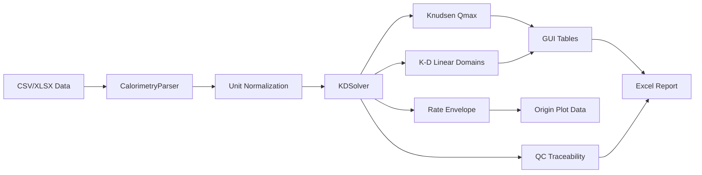

<p align="center">
  <h1 align="center">🌌 Hydration Kinetics Pro (HK-Pro)</h1>
  <p align="center">
    <strong>A Physics-Informed Computational Framework for Cementitious Hydration Kinetics</strong>
    <br><br>
    <a href="https://www.python.org/"></a>
    <a href="https://scipy.org/"></a>
    <a href="https://pandas.pydata.org/"></a>
    <a href="https://www.qt.io/"></a>
    <a href="LICENSE"></a>
  </p>
</p>

---

## 📑 Abstract

**Hydration Kinetics Pro (HK-Pro)** 是一个面向水泥基材料等温量热数据的桌面分析工具，用于从热流与累计放热曲线中提取 Krstulovic-Dabic (K-D) 水化动力学参数，并导出适合 OriginLab 或论文绘图整理的源数据。

本项目核心关注三件事：

1. **单位明确**：输入数据必须声明是总热流/总热量，还是已经按质量归一化的 mW/g 与 J/g。
2. **失败显式**：当数据不足以支撑 K-D 分段拟合时，程序会报错，而不是悄悄返回默认参数。
3. **结果可追溯**：导出 Knudsen 外推、K-D 分段拟合、理论速率包络线、QC 追溯表和 warning 记录，便于复查和二次绘图。

---

## 🧮 Physics-Informed Core Equations

### Phase 1: Nucleation and Crystal Growth (NG Stage)

$$[-\ln(1-\alpha)]^{1/n} = K_1'(t-t_0)$$

$$F_{NG}(\alpha) = K_1 n (1-\alpha) [-\ln(1-\alpha)]^{\frac{n-1}{n}}$$

### Phase 2: Phase Boundary Interaction (I Stage)

$$1-(1-\alpha)^{1/3} = K_2'(t-t_0)$$

$$F_I(\alpha) = 3 K_2 (1-\alpha)^{2/3}$$

### Phase 3: Diffusion Control (D Stage)

$$\left[1-(1-\alpha)^{1/3}\right]^2 = K_3'(t-t_0)$$

$$F_D(\alpha) = \frac{3 K_3 (1-\alpha)^{2/3}}{2 [1 - (1-\alpha)^{1/3}]}$$

---

## 📥 Input Data Format

当前支持：

- `.csv`
- `.xlsx`

旧式 `.xls` 暂不支持。请先在 Excel/WPS 中另存为 `.xlsx`，避免 pandas/xlrd 环境差异导致读取失败。

### 必需列

| 物理量 | 推荐表头 | 说明 |
| :--- | :--- | :--- |
| 时间 | `time_h` | 单位必须是 h |
| 热流 | `heat_flow_mw` 或 `heat_flow_mw_g` | 由 GUI 单位模式决定是否除以质量 |
| 累计热量 | `cumulative_heat_j` 或 `cumulative_heat_j_g` | 由 GUI 单位模式决定是否除以质量 |

### 单位模式选择

GUI 中必须选择输入数据单位：

| 模式 | 适用数据 | 程序处理 |
| :--- | :--- | :--- |
| 总热流 mW / 总热量 J | 仪器导出未归一化数据 | 自动除以样品质量，得到 mW/g 与 J/g |
| 已归一化 mW/g / J/g | 仪器或你自己已经归一化 | 不再除以质量，避免二次归一化 |

示例文件：`examples/sample_96h_calorimetry_normalized.csv`

---

## 🚀 Quick Start

```bash
pip install -r requirements.txt
python main.py
```

建议先用示例数据测试：

1. 打开 GUI。
2. 导入 `examples/sample_96h_calorimetry_normalized.csv`。
3. 单位模式选择“已归一化 mW/g / J/g，不再除以质量”。
4. 点击“执行动力学全解析”。
5. 根据需要导出 Excel 报表或图像。

---

## ✅ Tests

```bash
pytest
```

测试覆盖内容：

- normalized 模式不会二次除以质量。
- total 模式会按样品质量归一化。
- 表头单位与 GUI 单位模式不一致时会显式报错。
- `.xls` 会被明确拒绝。
- 96 h 合成量热数据可跑通 parser + solver。
- 极短数据会显式抛出 `KineticsCalculationError`。

---

## 🧬 Output Pipeline

一键导出的主数据报表包含 QC 追溯表：

| 工作表 | 内容 | 用途 |
| :--- | :--- | :--- |
| `QC_Traceability` | 样品名、源文件、输入单位模式、识别单位模式、样品质量、Qmax 方法 | 追溯结果来源与单位处理 |
| `QC_R2_Review` | Knudsen / NG / I / D 的 R² 与质量判读 | 快速判断拟合结果是否适合作为论文定量结果 |
| `QC_Warnings` | solver warning 与 fallback 提醒 | 保留所有需要人工复核的风险点 |
| `Tab5_Knudsen` | Qmax、t50、Knudsen 方程、R²、Qmax 方法 | 检查 Qmax 外推合理性 |
| `Tab6_KD_Eqs` | NG / I / D 分段方程、R²、质量标签 | 复查 K-D 参数来源 |
| `Tab7_KD_Params` | n、K1、K2、K3、α1、α2 | 论文主参数表 |

另行导出的 `Origin_Plot_Data.xlsx` 包含三个工作表：

| 工作表 | 内容 | 用途 |
| :--- | :--- | :--- |
| `1_Knudsen拟合` | `1/(t-t0)` 与 `1/Q` | 复现 Qmax 外推图 |
| `2_KD分段散点拟合` | NG / I / D 分段线性化数据 | 复现 K-D 分段拟合图 |
| `3_理论速率包络线` | 实验速率与理论速率函数 | 判断机制控制区间与 α1/α2 |

图像导出会生成 1 张 dashboard 总图和 4 张独立 600 dpi cropped publication figures。

---

## 🛠️ Architecture



---

## 👨‍🔬 Citation

如果 HK-Pro 协助你整理等温量热数据或水化动力学参数，请在论文、报告或项目说明中注明本仓库来源。

> Li, Q. (2026). *Hydration Kinetics Pro: A Physics-Informed Computational Framework for Cementitious Hydration Kinetics*. GitHub Repository. https://github.com/liqinglq666/Hydration-Kinetics-Pro

---

## ⚖️ License

本仓库当前采用 **All Rights Reserved**。公开可见不等于开放授权。未经作者书面许可，不得复制、修改、再分发、商用或制作衍生软件包。
